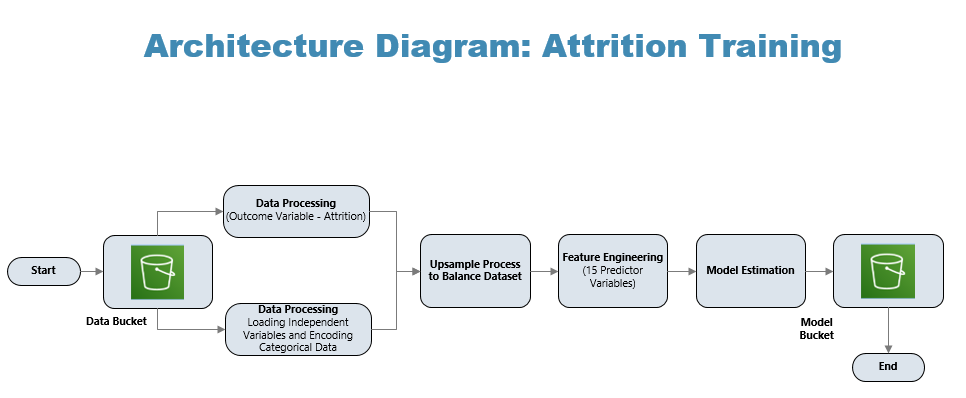
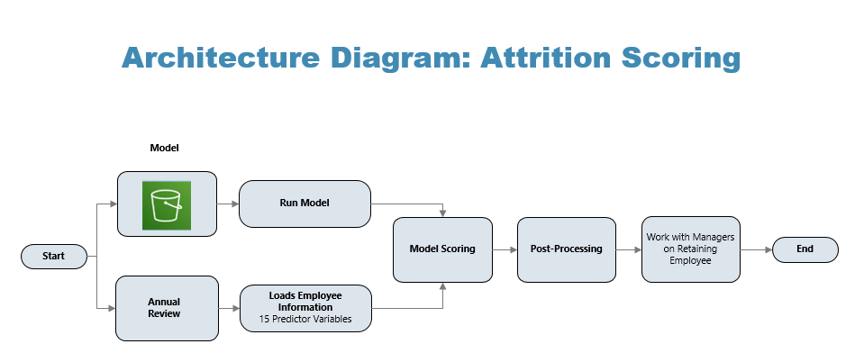
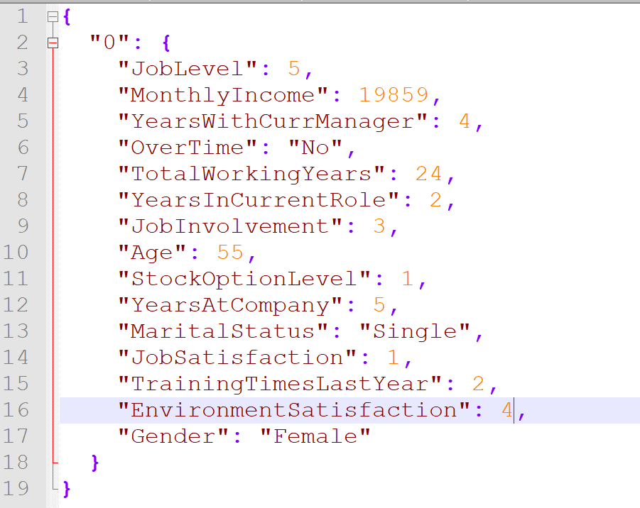
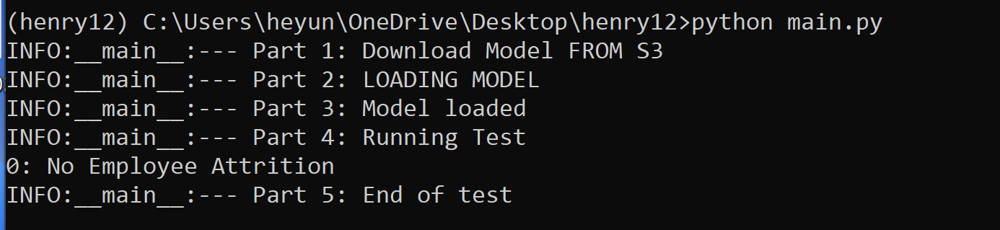
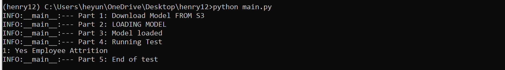
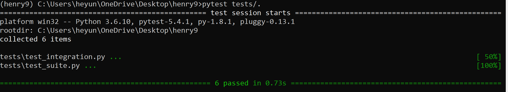

# Business Use Case: Employee Attrition

### Statement of Problem 
* Companies have to spend millions every year for employee attrition. 

### Client: 
* HR Department or Company

### Key Business Question:

* Are there (any) aspects that could be used to prevent employee attrition before it occurs at a company?

### Data source(s):
* https://www.kaggle.com/pavansubhasht/ibm-hr-analytics-attrition-dataset

### Business impact of work:
* In 2018 a staggering 41.4 million U.S. workers voluntarily left their jobs. 
* (Conservatively) Suppose that:
  -   There are 150 employees at a company
  -   The attrition rate is 10%.

  -   Total Employee expenses for attrition is $90,000
  -   → Cost to  the Company is $1.35M
* → If we can reduce attrition by 20%, we can save the company $270,000 a year

### Business impact of work:
* How business will use (predicted) model to make decision(s): 
  -   After a company review or survey, the model will predict whether a employee is likely to leave.
  -   For employees that are predicted to leave, see if improving any of the features would prevent attrition.
  
### Architecture Diagram Training:

### Architecture Diagram Scoring:

### Python Version:
* The Python Version to run this model is 3.6.10.
### Diagram Question:
* Which components are shared between training and scoring?
  -   The feature engineering for 15 predictor variables are shared between training and scoring. 
  -   The model will use these features to predict Attrition 
  -   The scoring will also be streaming process instead of a batch process. 
  
### Code Directory:
 * Navigate to file directory
    -   cd /testfolder/  (For main.py and json file) 
    -   cd /testfolder/tests  (For tests py files) 
 
### Code Direction:
 * Navigate to file directory
 * Create a new environment conda create --name environmentname
 * Activate the environment conda create --activate environmentname
 * Install requirements.txt file  conda install --file requirements.txt
 * Update Json File with Text Editor or Notepad (see json input below for more details)
 * Run the commandline python main.py or python3 main.py  
 * Run the commandline pytest tests/.  (Install pytest if not found conda install pytest)
 * Run the commandline pylint main.py  (Install pylint if not found conda install pylint)

### Input + Output Spec Training:
* Input: pandas DataFrame containing:
  -   JobLevel 
  -   MonthlyIncome
  -   YearsWithCurrManager 
  -   OverTime
  -   TotalWorkingYears
  -   YearsInCurrentRole 
  -   JobInvolvement
  -   Age
  -   StockOptionLevel 
  -   YearsAtCompany 
  -   MaritalStatus
  -   JobSatisfaction 
  -   TrainingTimesLastYear 
  -   EnvironmentSatisfaction
  -   Gender
* Output: Attrition Value (Yes or No):
  -   It will be a number that the model will display
  -   1 means employee attrition
  -   0 means no employee attrition

### Input + Output Spec Scoring:  
* Input: Json File containing the 15 variables:
  -   JobLevel - (Input integer value for job level) (Ex: 1)(1-Regular Employee, 2- Consultants, 3-Managers, 4-Senior Manger, 5-Executives)
  -   MonthlyIncome -  (Input integer value) (Ex: 3000) Monthly Income of the employee
  -   YearsWithCurrManager - (Input integer value for years with current manager) (Ex: 10)
  -   OverTime  - (__Str__ input for overtime: Yes or No)(Ex: 'Yes')
  -   TotalWorkingYears - (Input Integer value for total years working in total) (Ex: 10)
  -   YearsInCurrentRole - (Input integer value for years in curr role. Employee can work 7 years at the company but 5 years in currole) (Ex: 5)
  -   JobInvolvement - (Input integer value Employee's Job Involvement. 5 is the highest) (Ex: 3)
  -   Age (Input integer value for employee's age. The employee should be 18 or older) (Ex: 18)
  -   StockOptionLevel (Input integer value for Stock option approval level. 0-3 Ref: [Link](https://investorplace.com/2009/03/option-approval-levels-explained) 0 - Stand for Approval Level 1 based on the reference)
  -   YearsAtCompany (Input integer value for Employee total year working. It does not need to be at this company) (Ex: 3)
  -   MaritalStatus (__Str__ value for Employee Marital Status. Options are Single, Married, Divorced) (Ex: 'Single')
  -   JobSatisfaction (Input integer value for Employee Job Satisfaction. 1-5 with 5 is the highest) (Ex : 5)
  -   TrainingTimesLastYear (Input integer value for how many times an employee went to training. ) (Ex : 6)
  -   EnvironmentSatisfaction  (Input integer value for an employee's environment satisfaction. 1-5 with 5 is the highest) (Ex : 5)
  -   Gender - (__Str__ input for overtime: Male or Female)(Ex: 'Male')
### Screenshot of Json Input File with Text Editor Notepad++

  
  
* Output: Attrition Value and Message:
  -   It will be a number and message that the model will display
  -   1 means employee attrition
  -   0 means no employee attrition
### Screenshot of Successful Model Run - No Employee Attrition
- Here are is an image of a successful model run 
  
  
### Screenshot of Successful Model Run - Employee Attrition
- Here is another image of a successful model run. However, this shows the Employee Attrition
  
  
### Py Test:
* test_suite.py
  -   Test suite was added to test input parameters. We want to test input parameters to ensure accurate data is loaded to the model. The input tests categorical data and ensure the user only inputs the variables types specified. For Overtime, the input should only be "Yes" or "No"
* test_integration.py
  -   Test integration was added to test the compliation of functions to see if they work together as expected. The functions I choose were the integration of the json input file for scoring. This is important because the functions need to integrate together correctly for the model to predict accurately. The functions tested were json_file_processor,convert_json_var, and organize_json_input. The test begins by loading the json file and checking for completeness. Afterwards, the categorical variables are transformed and tested. Finally, the variables are rearrange and the column order is tested in order to ensure the json df is ready for the model prediction.
  
### Py Test Success Screenshot:
- A similar message will display if you run the pytest tests/. successfully

  

